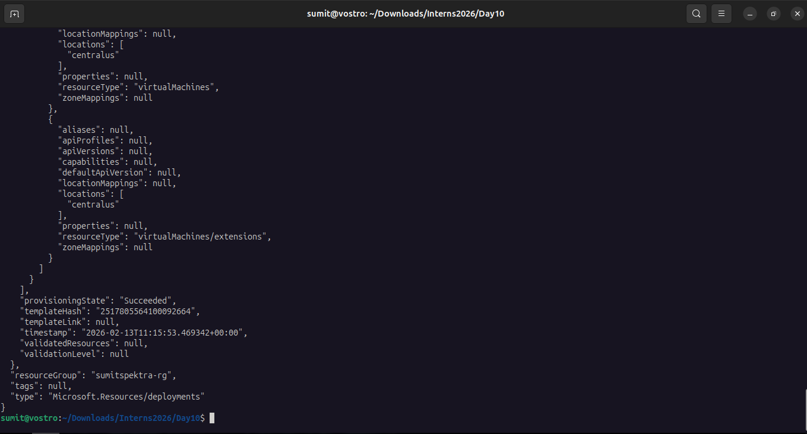
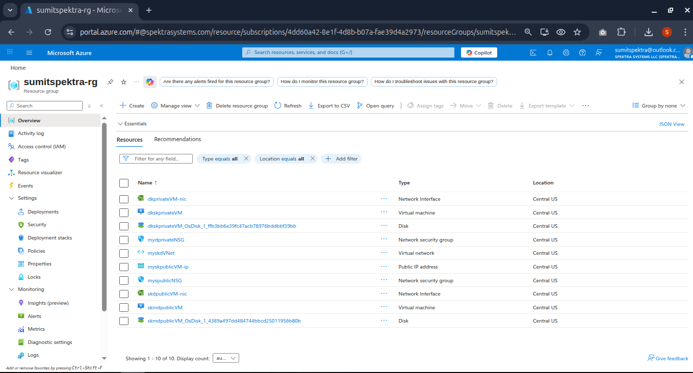

# Task 1:

Summary
Create:

1 Virtual Network
2 Subnets (Public + Private)
2 NSGs
1 Public IP
2 Ubuntu VMs

NGINX installed only on private VM with Custom html Script

How many way to access the html website, those present in private vm

## Solution

### Proxy on Public VM

SSH into Public VM:
ssh azureuser@<public-ip>

### Install nginx on Public VM:

sudo apt update
sudo apt install nginx -y

Edit config:
sudo nano /etc/nginx/sites-available/default

Replace with:
server {
listen 80;

    location / {
        proxy_pass <private vm private ip>;
    }

}

sudo systemctl restart nginx
http://<Public-VM-Public-IP>

## Commands

az deployment group create \
 --resource-group sumitspektra-rg \
 --template-file deploymachine.json \
 --parameters adminPassword='Imsk@123456789'

## Deployment Screenshot

