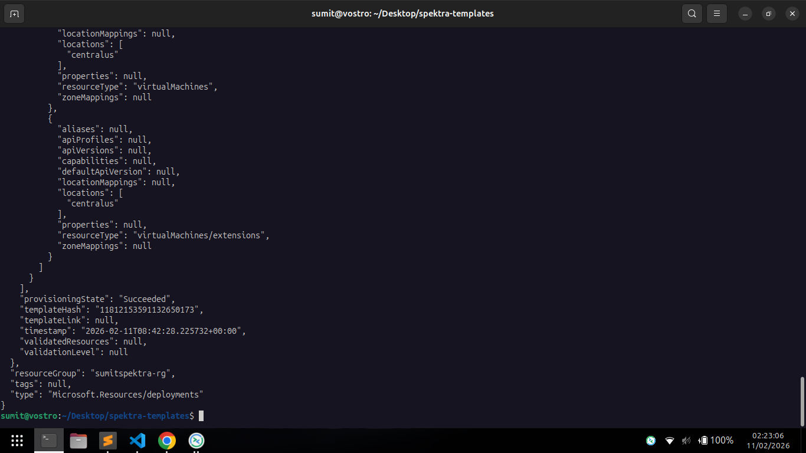
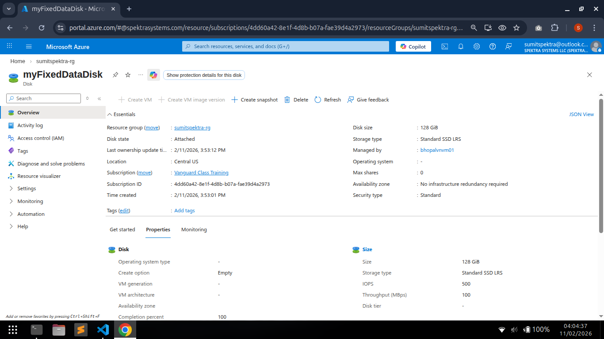
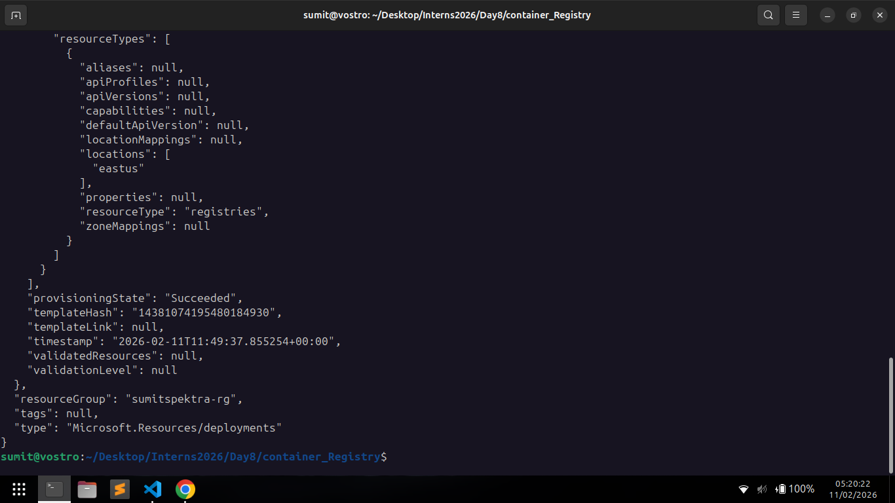
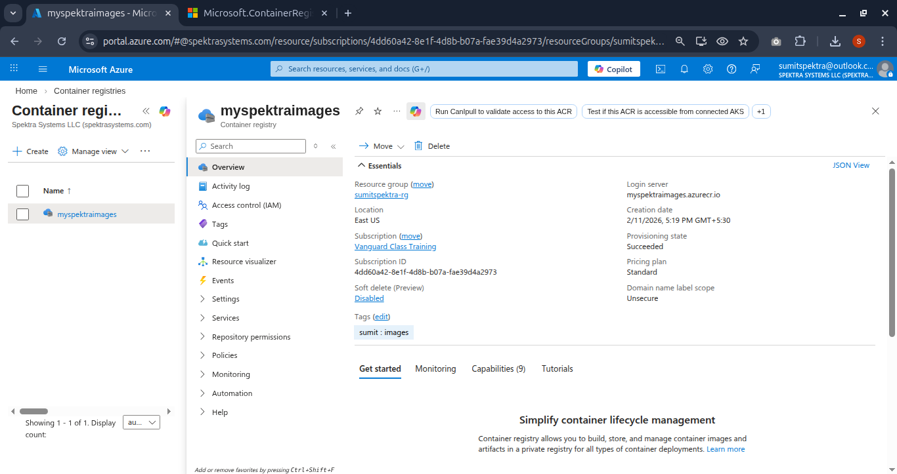
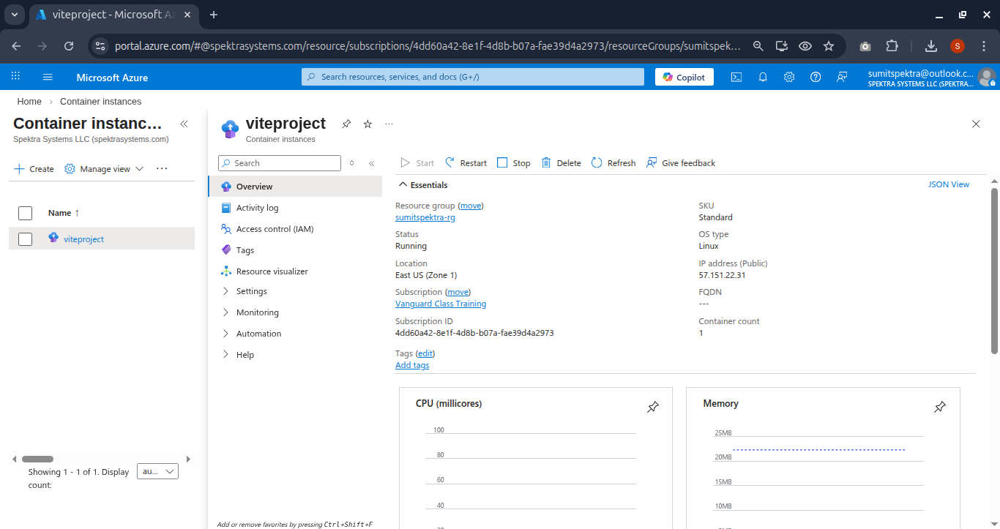
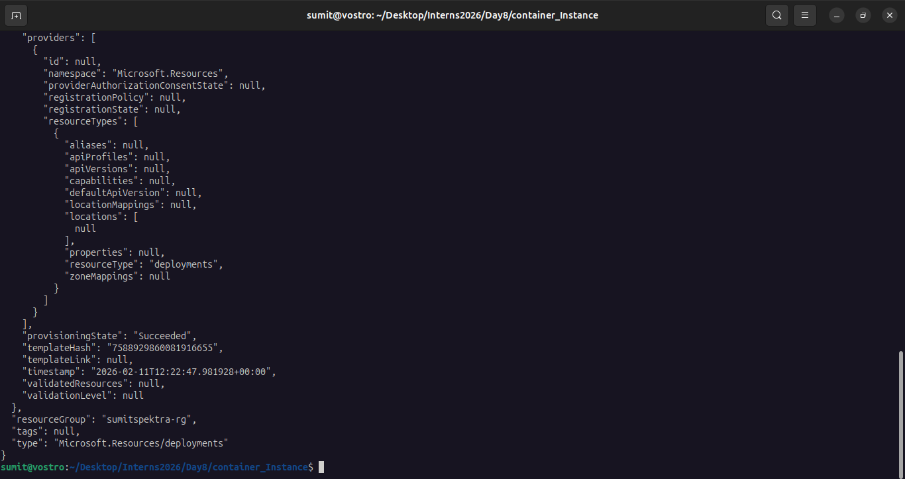
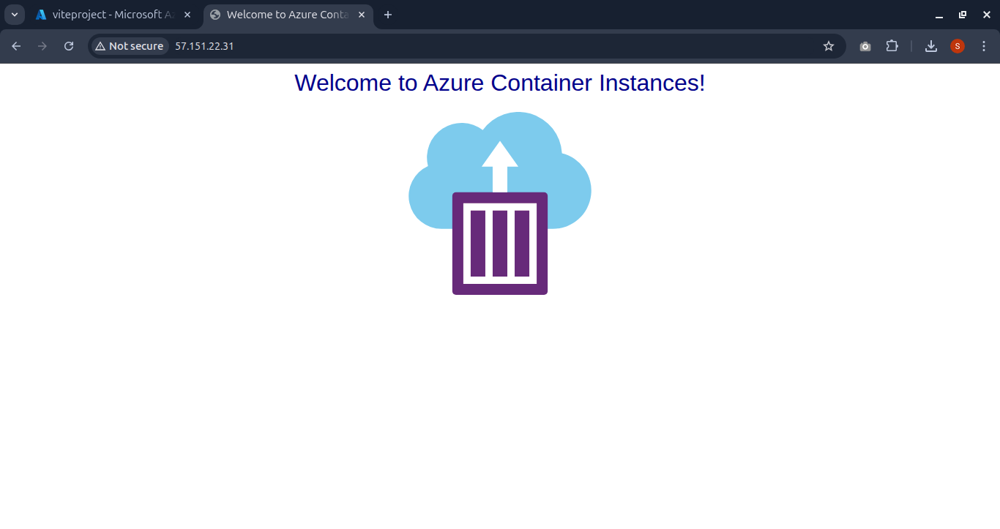

Task 1 :
How can Deploy an ARM template to deploy a Windows Server 2022 virtual machine in Azure with a virtual network, subnet, network security group (allowing RDP and HTTP), static public IP address, Trusted Launch security enabled, and automatically install IIS using a Custom Script Extension while outputting the public IP address?

Task 2:
Create disk and attach to virtual machine, in existing arm template

Task 3
Create ARM Template for Azure Registry

Task4 
Create ARM Template for Container Instance Service

## Deployment Result

All Task Done

## Deployment Screenshot

## Task 1 Create VM Install IIS and Custom Script for index.html

## Task 2: Create disk and attach to virtual machine

## Task 3:  Azure Registry

## Task 4: Container Instance Service

