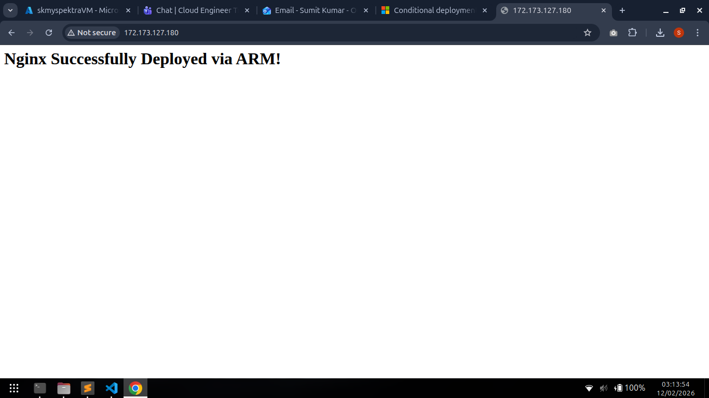
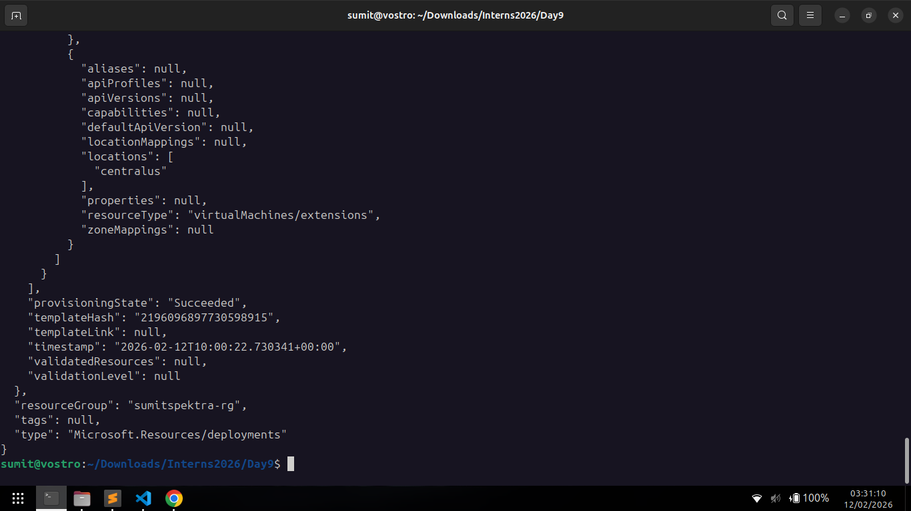
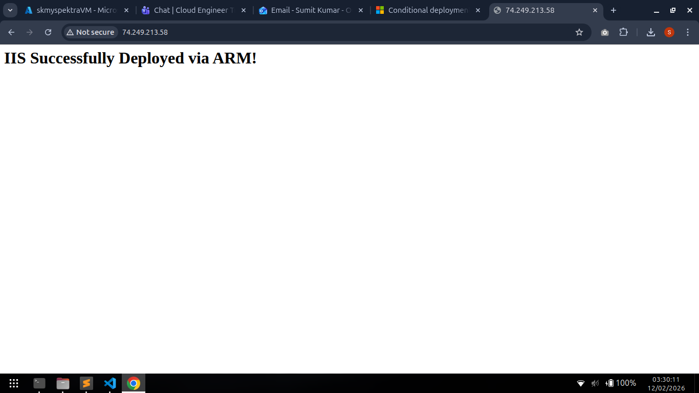
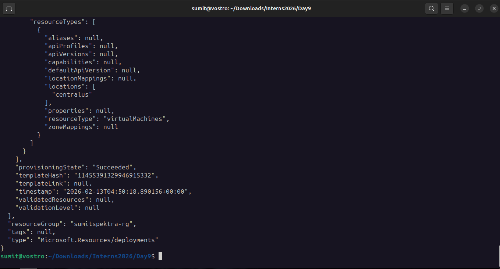
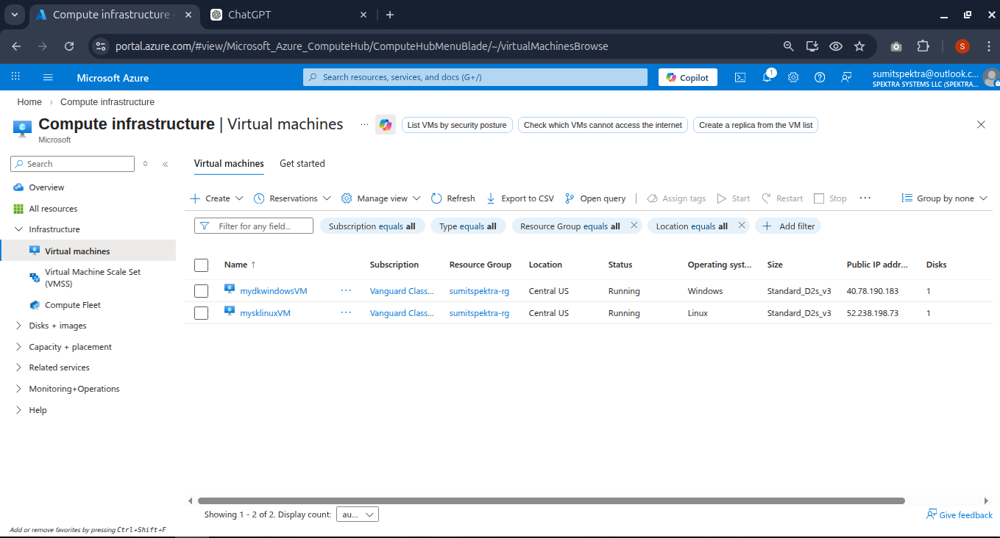

task 1 monitor deployment


task 2 create vm based on os type linux and windows , give the ostype in parameter


Task 3 Create two different vm machine in one network

## Logic
```bash
[if(equals(parameters('osType'),'linux'), variables('linuxImage'), variables('windowsImage'))]

"condition": "[equals(parameters('osType'),'linux')]"

"condition": "[equals(parameters('osType'),'windows')]"
```

## Deploy Linux + Nginx
```bash
az deployment group create \
  --resource-group sumitspektra-rg \
  --template-file deploymachine.json \
  --parameters adminUsername=ubuntu \
               adminPassword='Imsk@123456789' \
               osType=linux
```

## Two  Different vm machine 
```bash
az deployment group create \
  --resource-group sumitspektra-rg \
  --template-file twomachine.json \
  --parameters adminUsername=imskadmin \
               adminPassword='Imsk@123456789'
```

## Deploy Windows + IIS
```bash  
az deployment group create \
  --resource-group sumitspektra-rg \
  --template-file deploymachine.json \
  --parameters adminUsername=imskadmin \
               adminPassword='Imsk@123456789' \
               osType=windows
```
## Deployment Screenshot

## Linux Machine



## Windows Machine




## two Different vm machine 

