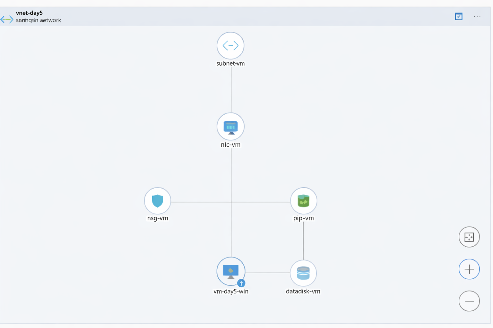
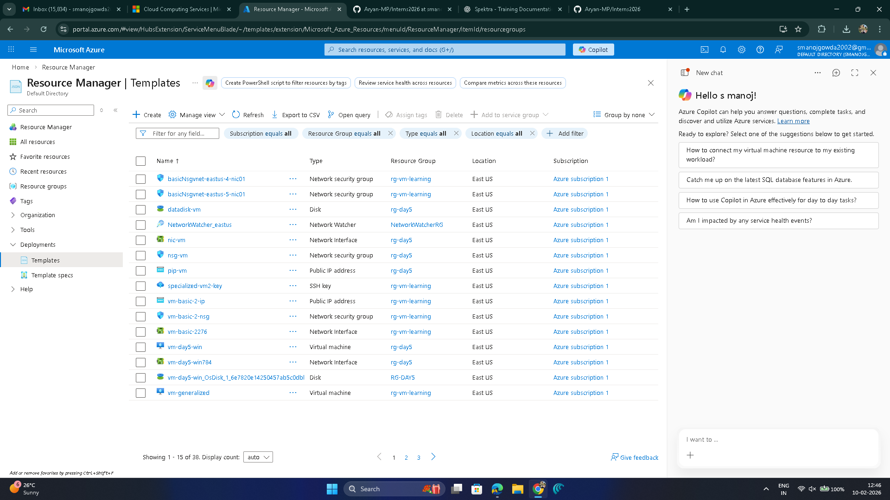
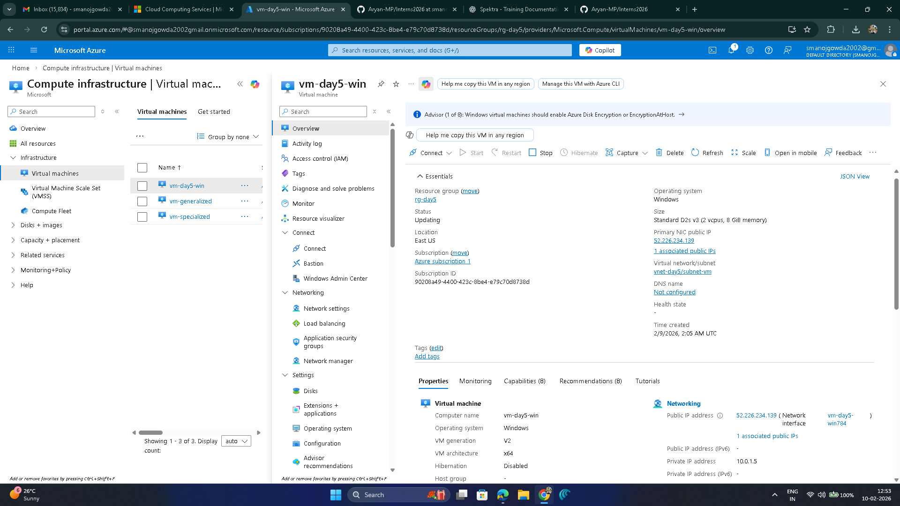

# Day 5 – Assessment: The Infrastructure Challenge

## Objective
To manually create and connect all required Azure infrastructure components to deploy a functional Virtual Machine.  
The goal is to understand how each resource works together instead of using the Quick Create option.

---

## Scenario
A standalone server needed to be deployed in Azure.  
Instead of using automatic VM creation, all networking, security, storage, and compute components were created and connected step by step.

This approach helps in understanding real-world infrastructure design and troubleshooting.

---

# Exercise 1

## Task 1: Networking Setup

### What it is
Creating the network environment required for the Virtual Machine.

### Why it is done
- Every VM needs a network to communicate
- Proper address space allows future expansion
- Networking must exist before VM creation

### How it is done
- Created a Virtual Network (VNet)
- Defined an address space
- Created a Subnet inside the VNet

---

## Task 2: Security and Entry Points

### What it is
Setting up security rules and external access.

### Why it is done
- To control inbound traffic
- To allow remote management of the VM
- To protect the VM from unwanted access

### How it is done
- Created a Network Security Group (NSG)
- Added an inbound rule to allow remote access (RDP/SSH)
- Created a Public IP Address for external connectivity

---

## Task 3: The Connection Layer (NIC)

### What it is
The Network Interface Card (NIC) connects the VM to the network.

### Why it is done
- VM cannot communicate without a NIC
- NIC links networking, security, and public access

### How it is done
- Created a Network Interface
- Manually associated the NIC with:
  - Virtual Network
  - Subnet
  - Network Security Group
  - Public IP Address

---

## Task 4: Storage Allocation

### What it is
Allocating storage resources for the Virtual Machine.

### Why it is done
- OS disk alone is not enough for all workloads
- Data disks are used to store application or user data
- Disk must be in the same region to avoid latency

### How it is done
- Created a Managed Data Disk
- Ensured the disk was in the same region as the VM

---

## Task 5: Final Assembly (Compute)

### What it is
Creating the Virtual Machine using pre-created resources.

### Why it is done
- To avoid automatic resource creation
- To gain full control over infrastructure
- To understand dependency between resources

### How it is done
- Created a Virtual Machine
- Attached the existing Network Interface
- Attached the existing Managed Data Disk
- No new networking or storage was created during this step

---

## Task 6: Validation

### What it is
Verifying that the infrastructure was created correctly.

### Why it is done
- To ensure the VM is working
- To confirm resources are connected properly

### How it is done
- Verified VM status from Azure Portal
- Confirmed successful VM deployment
- Checked that networking and connectivity were active

---

## Screenshots

### Infrastructure Topology
Shows the relationship between VM, NIC, NSG, VNet, Subnet, Public IP, and Disk.

---

### Deployment History
Shows step-by-step creation of networking, security, storage, and compute resources.

---

### Virtual Machine Overview
Shows VM status, region, and public IP confirming successful deployment.

---

## Assessment Outcome
- Successfully deployed a Virtual Machine using manual infrastructure setup
- Understood how networking, security, storage, and compute are connected
- Gained confidence in infrastructure-level VM deployment
- Learned to avoid dependency on automatic VM creation
- Developed troubleshooting and design understanding
