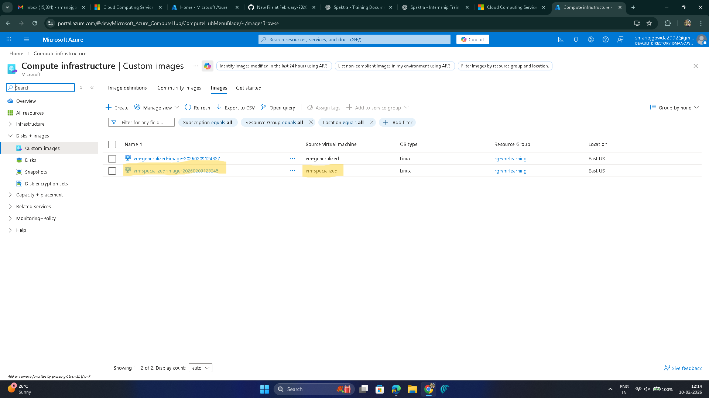
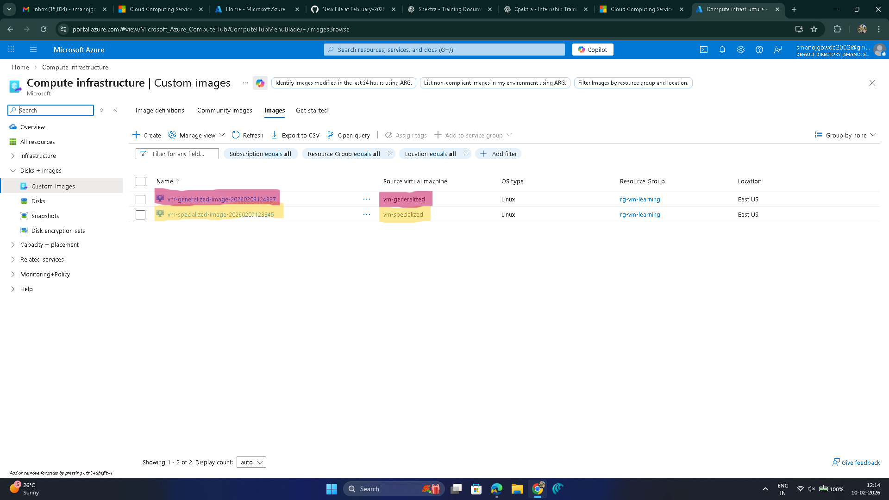
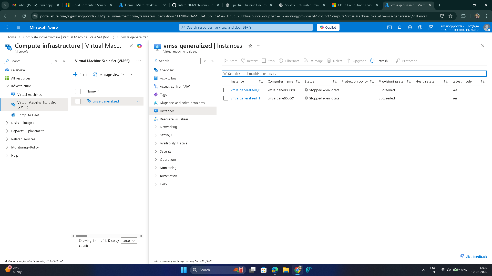
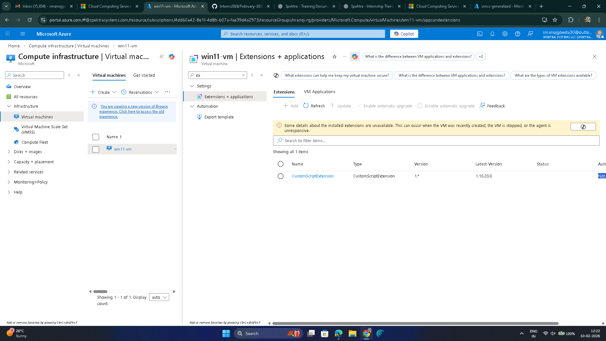
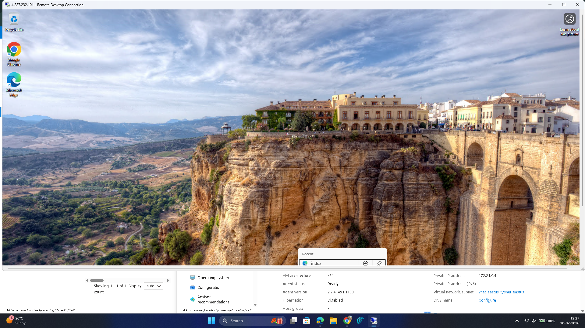

# Day 6 – Assessment & Solution  
## OS Images, Generalized vs Specialized, VMSS & Automation

---

## Objective
To understand OS images in Azure, create specialized and generalized images, use images for scaling with VM Scale Sets, and automate software installation using Custom Script Extension.

---

# Assessment 1 – OS Images, Generalized vs Specialized, VMSS

## Task 1: Create Specialized Image

### What it is
A specialized image is an exact copy of a Virtual Machine that keeps users, settings, and configurations.

### Why it is done
- To clone an existing VM
- To create another VM with the same setup
- Useful when exact duplication is required

### How it is done
- Created a base Virtual Machine
- Installed required software
- Stopped the VM
- Used the **Capture** option
- Selected image type as **Specialized**
- Created the specialized image

### Screenshot

---

## Task 2: Create Generalized Image

### What it is
A generalized image is a clean VM template without machine-specific data like users and hostname.

### Why it is done
- Required for scaling and VM Scale Sets
- Used for creating multiple identical VMs
- Best option for production and automation

### How it is done
- Generalized the base VM
  - Used Sysprep for Windows or waagent for Linux
- Shut down the VM
- Captured the VM as a **Generalized** image

### Screenshot

---

## Task 3: VM Scale Set (VMSS) using Image

### What it is
VM Scale Set allows creating and managing multiple identical VMs using a single image.

### Why it is done
- To support auto-scaling
- To handle load automatically
- To maintain consistency across VMs

### How it is done
- Used the generalized image as base
- Created a VM Scale Set
- Verified instances were created from the image

### Screenshot

---

# Assessment 2 – Automation using Custom Script Extension

## Task 4: Custom Script Extension

### What it is
Custom Script Extension runs scripts automatically on a VM without manual login.

### Why it is done
- To automate software installation
- To reduce manual work
- To ensure same setup on every VM

### How it is done
- Opened the Virtual Machine
- Went to **Extensions + Applications**
- Added **Custom Script Extension**
- Used a script to:
  - Install IIS
  - Install Google Chrome
  - Create IIS data folder
- Ran the extension successfully

### Screenshot

---

## Task 5: Verify IIS Deployment

### What it is
Checking whether IIS was installed successfully using automation.

### Why it is done
- To confirm automation worked correctly
- To verify web server deployment

### How it is done
- Opened browser
- Entered VM public IP address
- Verified IIS default page loaded

### Screenshot

---

## Assessment Outcome
- Specialized image created successfully
- Generalized image created successfully
- VM Scale Set created using generalized image
- Automation executed using Custom Script Extension
- IIS deployed without manual VM login
- Understood image-based scaling and automation concepts
