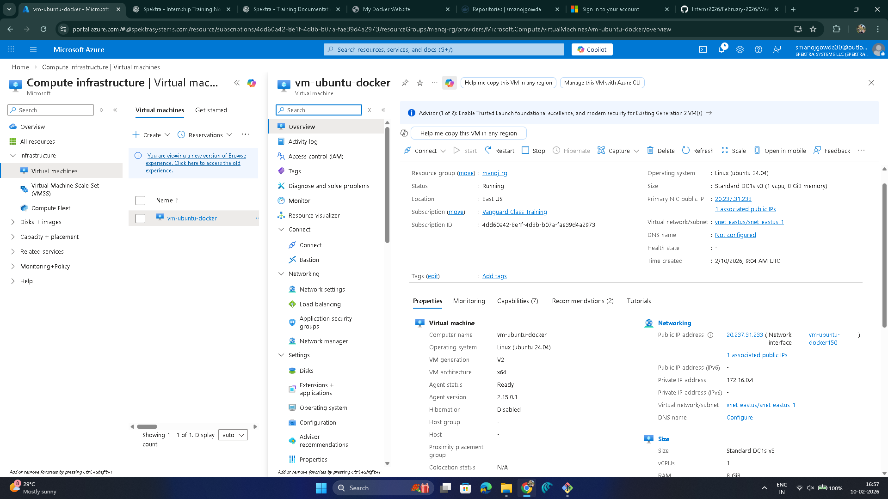
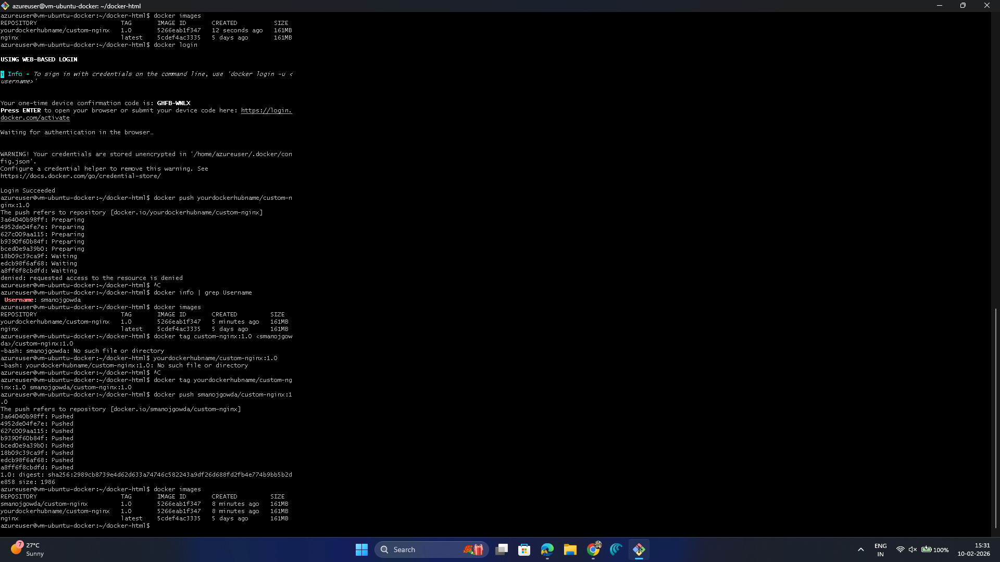
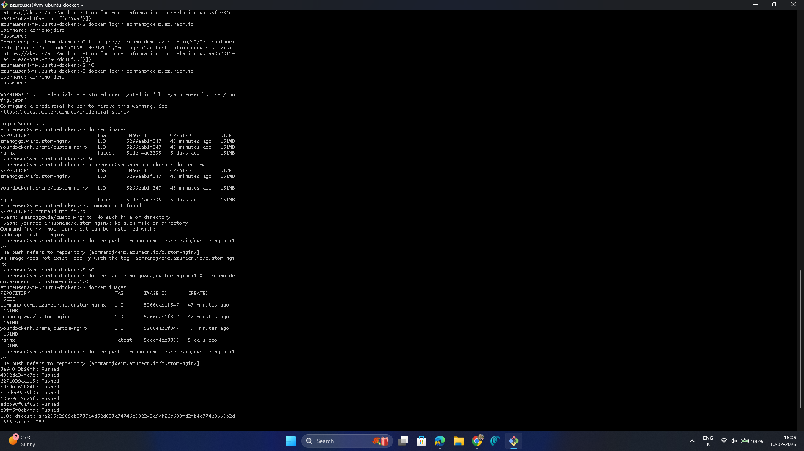

# Day 7 – Assessment & Solution  
## Docker, Containers & Azure Container Registry (ACR)

---

## Assessment Objective
To deploy a web application using Docker, package it as a container image, and store the image in Docker Hub and Azure Container Registry (ACR) using command-line tools.

---

## Task 1: Create Ubuntu Virtual Machine

### What it is
Creating a Linux Virtual Machine to act as the Docker host.

### Why it is done
- Docker needs a host machine to run
- VM provides OS, CPU, RAM, and network
- Used as build and test environment

### How it is done
- Created an Ubuntu Linux Virtual Machine
- Used the VM to install and run Docker

### Screenshot

---

## Task 2: Install Docker on Virtual Machine

### What it is
Installing Docker Engine on the VM.

### Why it is done
- Docker is required to build and run containers
- Without Docker, images cannot be created or pushed

### How it is done
- Installed Docker on Ubuntu VM
- Verified Docker installation using CLI
- Confirmed Docker service was running

---

## Task 3: Create and Build Docker Image

### What it is
Packaging a web application into a Docker image.

### Why it is done
- Docker image contains application and dependencies
- Image is portable and reusable

### How it is done
- Created a simple HTML website
- Created a Dockerfile using nginx as base image
- Built Docker image using Docker CLI

---

## Task 4: Push Docker Image to Docker Hub (CLI)

### What it is
Uploading the Docker image to Docker Hub using command line.

### Why it is done
- Docker Hub is a public container registry
- Allows sharing and testing of container images

### How it is done
- Logged in to Docker Hub using Docker CLI
- Tagged the image using Docker Hub format
- Pushed the image using `docker push`
- Verified successful upload from CLI output

### Screenshot

---

## Task 5: Create Azure Container Registry (ACR)

### What it is
Creating a private container registry in Azure.

### Why it is done
- To store container images securely
- Recommended for enterprise and production workloads

### How it is done
- Created Azure Container Registry
- Used ACR as private image repository

---

## Task 6: Push Docker Image to Azure Container Registry (CLI)

### What it is
Uploading Docker image to Azure Container Registry using command line.

### Why it is done
- To integrate Docker workflow with Azure services
- To securely store images in Azure

### How it is done
- Logged in to Azure Container Registry from VM
- Tagged Docker image using ACR login server name
- Pushed the image using `docker push`
- Verified successful upload from CLI output

### Screenshot

---

## Assessment Outcome
- Ubuntu VM successfully created as Docker host
- Docker installed and verified using CLI
- Web application containerized using Docker
- Docker image pushed to Docker Hub using CLI
- Azure Container Registry created
- Docker image pushed to ACR using CLI
- Understood end-to-end container workflow with Azure
