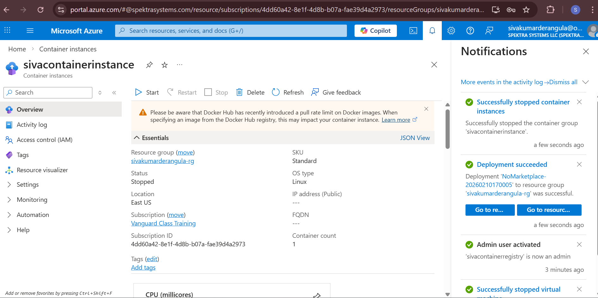
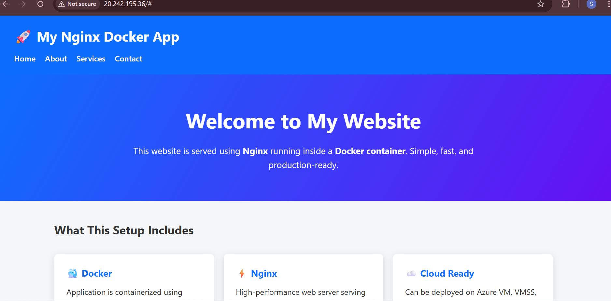

# 🚀 Docker & Azure End-to-End Hands-on Tasks

This repository contains a complete hands-on implementation of Docker and Azure container services.  
It covers Linux VM creation, Docker installation, and Nginx deployment using Docker.

---

## 🧩 Task 1: Create Linux VM, Install Docker & Run Nginx

### Objective
- Create a Linux Virtual Machine
- Install Docker
- Pull the latest Nginx image from Docker Hub
- Run Nginx on port **8080**
- Access Nginx using VM Public IP

---

### Steps

Update the system and install Docker:
```bash
sudo apt update
sudo apt install -y docker.io
sudo systemctl start docker
sudo systemctl enable docker
Pull the latest Nginx image:

docker pull nginx:latest
Run the Nginx container on port 8080:

docker run -d -p 8080:80 nginx
```

Output
Access the application using the VM public IP:

http://<VM_PUBLIC_IP>:8080
You should see the default Nginx Welcome Page in the browser.

/images/linux vm for nginx server.png
/images/nginx server image.png


## 🧩 Task 2: Create Docker Volume and Persist Nginx Data
## Objective

Create a Docker volume

--Attach the volume to the Nginx container
--Ensure data persists even after container deletion

Steps

Create a Docker volume:
docker volume create nginx-volume
Run Nginx container with volume attached:
docker run -d -p 8080:80 \
-v nginx-volume:/usr/share/nginx/html \
nginx


Remove the container:
docker rm -f <container_id>


Re-run Nginx using the same volume:

docker run -d -p 8080:80 \
-v nginx-volume:/usr/share/nginx/html \
nginx

Output

---Nginx continues to run successfully
---Data remains intact even after container recreation

Screenshots:

/images/modified nginx server html.png

## 🧩 Task 3: Modify Nginx index.html Using Docker Volume
## Objective

Modify the index.html file inside the mounted Docker volume

Reflect the changes through the VM Public IP

Steps

Access the running container:

docker exec -it <container_id> bash


Navigate to Nginx HTML directory:

cd /usr/share/nginx/html


Modify the index file:

echo "<h1>Welcome to Custom Nginx Page</h1>" > index.html

Output

Refresh the browser:

http://<VM_PUBLIC_IP>:8080


The custom HTML page should now be visible.

Screenshots

/images/modified nginx server html.png
/images/steps inside conatiner image.png


## 🧩 Task 4: Create Custom Docker Image and Push to Docker Hub

### Objective
- Create a custom `index.html` file locally
- Create a `Dockerfile` for the custom HTML page
- Build a Docker image locally
- Push the Docker image to Docker Hub

---

### Files

**index.html**
``html
<h1>Hello from Custom Docker Image</h1>


Dockerfile

FROM nginx:latest
COPY index.html /usr/share/nginx/html/index.html

Steps

Build the Docker image locally:

docker build -t <dockerhub-username>/custom-nginx:v1 .


Login to Docker Hub:

docker login


Push the image to Docker Hub:

docker push <dockerhub-username>/custom-nginx:v1

Output

Custom Docker image successfully pushed to Docker Hub

Image is available publicly in Docker Hub repository

Screenshots:

--/images/docker basic commands.png
--/images/images pushed to docker.png
--/images/docker pull and push.png

## 🧩 Task 5: Push Docker Image to Azure Container Registry (ACR)

### Objective
- Create an Azure Container Registry (ACR)
- Tag a local Docker image
- Push the Docker image from local machine to Azure Container Registry

---

### Prerequisites
- Azure CLI installed and logged in
- Docker installed
- Existing Docker image available locally

---

### Steps

Create an Azure Container Registry:
``bash
az acr create \
  --name myacrregistry \
  --resource-group myResourceGroup \
  --sku Basic

  or you can create these things through azure portal.

Login to Azure Container Registry:

az acr login --name myacrregistry
Tag the local Docker image:

docker tag custom-nginx:v1 myacrregistry.azurecr.io/custom-nginx:v1
Push the image to ACR:

docker push myacrregistry.azurecr.io/custom-nginx:v1
Output
Docker image successfully pushed to Azure Container Registry

Image is visible in the ACR repository in Azure Portal

Screenshots:

--/images/azure container instance.png
--/images/container instance.png
--/images/docker commands performed.png

## 🧩 Task 6: Create Azure Container Instance Using Azure Portal

### Objective
- Create an Azure Container Instance (ACI)
- Use a Docker image stored in Azure Container Registry (ACR)
- Deploy and run the container using **Azure Portal**
- Access the application via public IP / DNS

---

### Prerequisites
- Azure Subscription
- Azure Container Registry (ACR) already created
- Docker image already pushed to ACR

---

### Steps (Using Azure Portal)

1. Login to **Azure Portal**
https://portal.azure.com


2. In the search bar, type **Container Instances** and click **Create**

3. Under **Basics**:
- Subscription: Select your subscription
- Resource Group: Select existing or create new
- Container name: `nginx-aci`
- Region: Select nearest region
- Image source: **Azure Container Registry**
- Registry: Select your ACR
- Image: `custom-nginx`
- Image tag: `v1`
- OS type: **Linux**

4. Under **Networking**:
- DNS name label: `nginx-aci-demo`
- Ports: `80`
- Public IP: **Yes**

5. Click **Review + Create**

6. Click **Create**

---

### Output
- Azure Container Instance is successfully deployed
- Container state shows **Running**
- Application is accessible using the public DNS name

Access the application:
http://nginx-aci-demo.<region>.azurecontainer.io


---

### Screenshots




