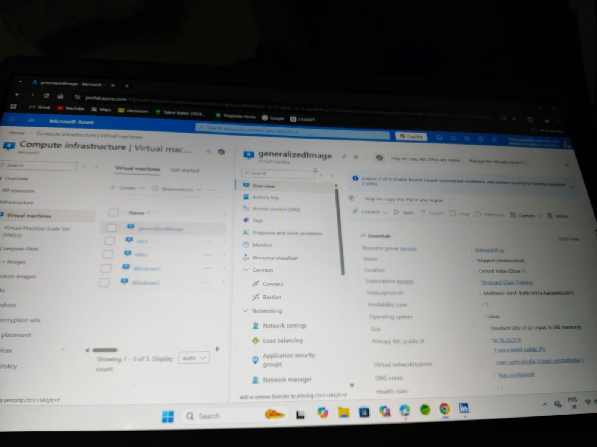
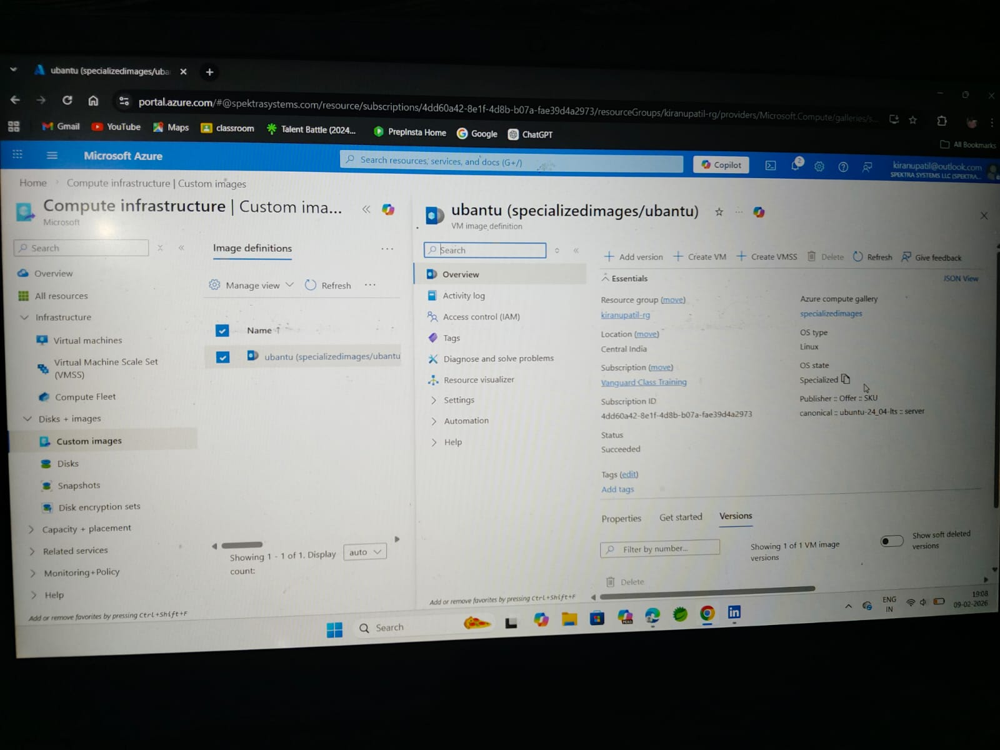
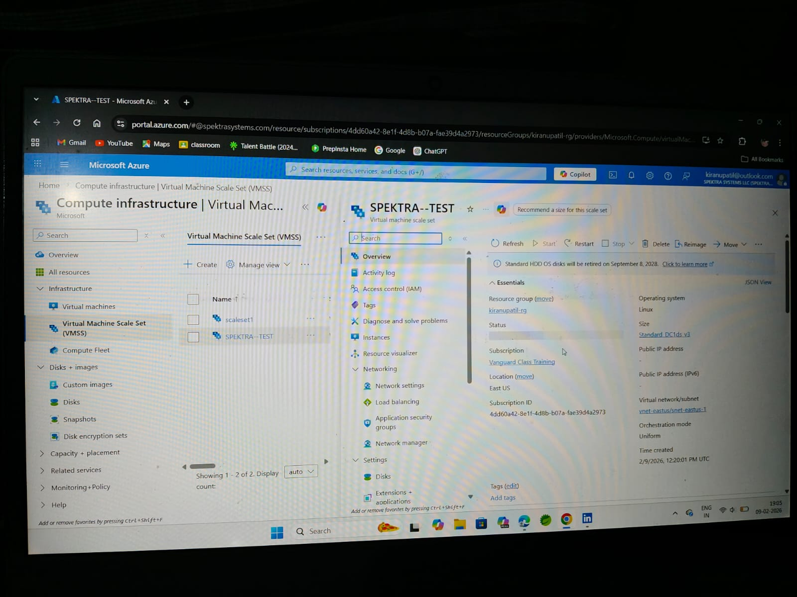

## Day 6 – Azure VM Image Creation

As part of Day 6 task, I created both **Generalized** and **Specialized** VM images in Microsoft Azure.

### 1️⃣ Generalized Image
The VM was generalized to remove machine-specific information and prepared for reusable image creation.



### 2️⃣ Specialized Image
The VM image was created in a specialized state, retaining machine-specific configuration.




### 3️⃣ Virtual Machine Scale Set (VMSS)

A Virtual Machine Scale Set was created to manage and scale multiple VM instances automatically.

- Scale set name: **SPEKTRA-TEST**
- Operating system: Linux
- Orchestration mode: Uniform



### 4️⃣ Compute Data – Custom Script Extension (CSE)

A Custom Script Extension was used during Virtual Machine provisioning to automate compute configuration tasks.

The script performs the following actions:
- Creates a directory for compute setup
- Installs IIS web server
- Deploys a sample web page
- Downloads and installs Google Chrome

This demonstrates automated compute configuration using Azure VM extensions.
# Configuration (what to install)

$InstallTerraform = $true
$TerraformVersion = "1.6.6"

$InstallIIS = $true
$IISMessage = "Hello World!"

$InstallChrome = $true
```

#### Custom Script Used
```powershell
$OutDir = "C:\CSE"
New-Item $OutDir -ItemType Directory -Force | Out-Null

# IIS (Server OS)
if (Get-Command Install-WindowsFeature -ErrorAction SilentlyContinue) {
    Install-WindowsFeature Web-Server -ErrorAction SilentlyContinue | Out-Null
    "Hello" | Out-File C:\inetpub\wwwroot\index.html -Force
    $IIS = $true
} else {
    # IIS (Client OS)
    Enable-WindowsOptionalFeature -Online -FeatureName IIS-WebServerRole -All -NoRestart
    "Hello" | Out-File C:\inetpub\wwwroot\index.html -Force
    $IIS = $true
}

# Chrome Installation
$ChromePath = "C:\Temp\chrome.exe"
New-Item C:\Temp -ItemType Directory -Force | Out-Null

Invoke-WebRequest `
    -Uri "https://dl.google.com/chrome/install/375.126/chrome_installer.exe" `
    -OutFile $ChromePath

Start-Process $ChromePath -ArgumentList "/silent /install" -Wait

