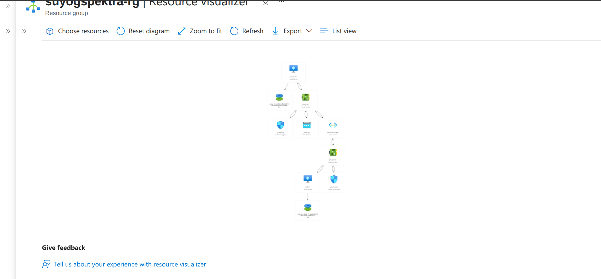

Task: 1 
   You have two vm one of the vm private you need to talk that vm how would you do ?

Answer = The task is completed by using reverse proxy or assingn private ip of your vm private vm to the another vm also you can do it by using this process     

Task: 2
  Create a Storage Account with bicep ?

Task: 3 
  Read the Powershell Command and try to execute ?

