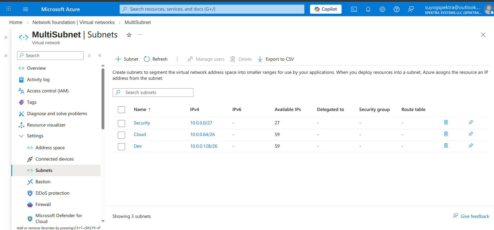

Task 1:
    CIDR (Classes Inter-Domain Routing)?
        You need to learn all the classes, Ip, Subnet Mask, Binary of IP.

Task 2:
    Create Vnet with three different subnet in the Cloud subnet have 30 ip, Security subnet have 20 and Devloper have 50 ip?
        The commond  to  deploy with ARM template . az deployment group create --resource-group suyogspektra-rg --template-file template.json
        