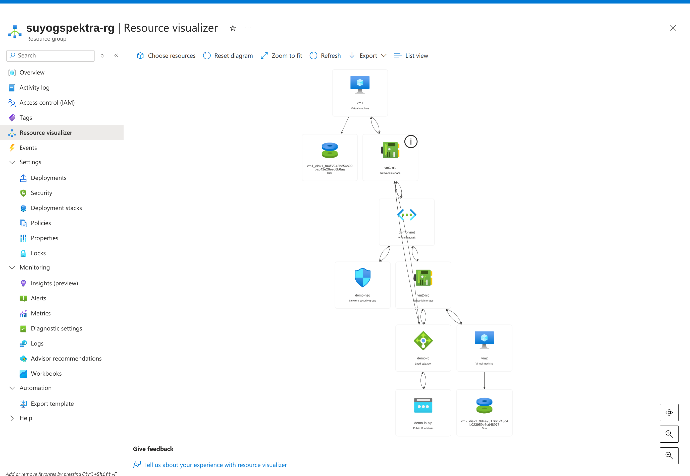

Task: Create a Load Balancer with arm template 
    The Load Balncer is used for managing incoming traffic comming to your vm, app service, function app, aks. There is your types of load balancer 1. Standard Load Balncer, 2. Application Gateway Load Balancer, 3. Azure Traffic Manager, 4. Azure Front Door CDN. For this task i used standard load balncer and two virtual machine one nsg, vnet,subnet,two nic card, pip for load balancer configure two vm in the backend pool.

Images:
    
    