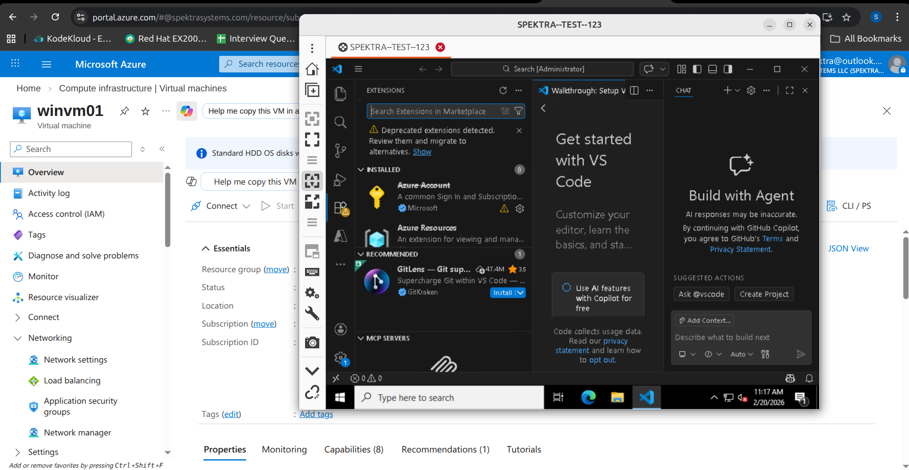

Task: Log_On_Task ?
    A Logon Task in Windows is a Scheduled Task that is configured to automatically execute a program or script whenever a user logs into the system. It is created using Task Scheduler and uses the AtLogOn trigger, which tells the operating system to run a specified action at the moment a user session starts. This mechanism is commonly used to perform user-specific configurations such as installing application extensions, mapping network drives, setting environment variables, or running initialization scripts that require a user profile context

Deployment Command:
    az deployment group create --resource-group suyogspektra-rg --template-file template.json --parameters parameters.json

Image of Deployment:
    

Task: Write a ARM Template for RABC (Role Based Access Control) ?
    Role-Based Access Control (RBAC) is a security model used to manage access to resources based on roles assigned to users, groups, or service principals. Instead of granting permissions directly to individual identities, RBAC defines roles that contain a set of allowed actions (such as read, write, or delete), and these roles are assigned at a specific scope such as a management group, subscription, resource group, or individual resource.

Deployment Command: 
    az deployment group create --resource-group suyogspektra-rg --template-file owner.json
