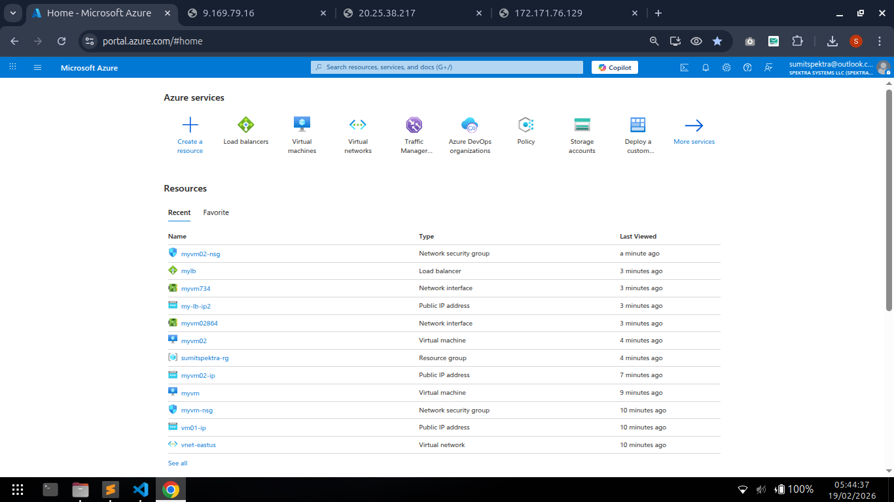
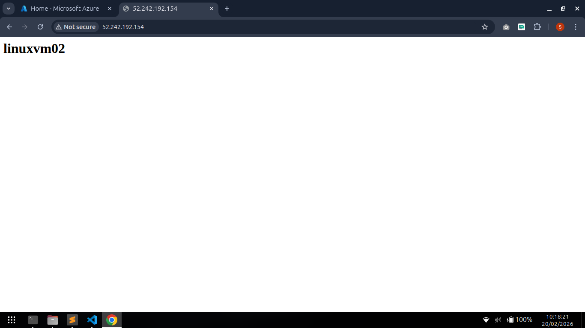

### Create 2 vm and add load balncer using UI and arm template

az deployment group create \
  --resource-group sumitspektra-rg \
  --template-file load-balancer.json \
  --parameters adminUsername=ubuntu \
               adminPassword='Imsk@123456789'

### GUI based

### ARM Templates Based
