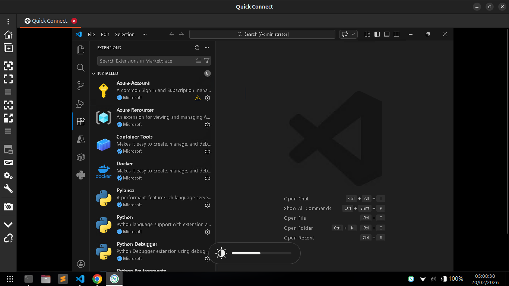
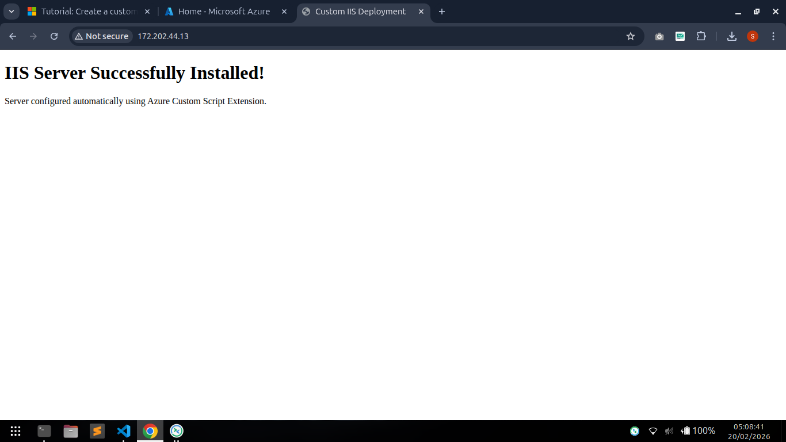

# Azure Windows VM + IIS + Development Environment Deployment

## Overview

This project deploys a fully configured Windows Server virtual machine in Microsoft Azure using an ARM template. After deployment, the VM is automatically configured with:

- Static Public IP
- RDP (3389) and HTTP (80) access
- IIS Web Server
- Custom `index.html` landing page
- Chocolatey package manager
- Visual Studio Code
- Git
- VS Code extensions (installed at first user logon)

All configuration is handled automatically using Azure Custom Script Extension.

---

## Architecture Components

The ARM template provisions the following resources:

- Virtual Network (`10.0.0.0/16`)
- Subnet (`10.0.0.0/24`)
- Network Security Group (NSG)
- Static Standard Public IP
- Network Interface (NIC)
- Windows Server 2022 Datacenter Gen2 VM
- Custom Script Extension

---

## ARM Template Details

### Parameters

| Parameter     | Type         | Description                       |
| ------------- | ------------ | --------------------------------- |
| vmName        | string       | Name of the virtual machine       |
| location      | string       | Azure region (default: centralus) |
| adminUsername | string       | Administrator username            |
| adminPassword | secureString | Administrator password            |

---

### Network Security Rules

| Rule Name  | Port | Protocol | Access |
| ---------- | ---- | -------- | ------ |
| Allow-RDP  | 3389 | TCP      | Allow  |
| Allow-Http | 80   | TCP      | Allow  |

> Note: Both ports are open to all sources (`*`). Restrict in production environments.

---

---

## Virtual Machine Configuration

| Setting   | Value                               |
| --------- | ----------------------------------- |
| OS        | Windows Server 2022 Datacenter Gen2 |
| VM Size   | Standard_D2s_v3                     |
| Public IP | Static (Standard SKU)               |
| Disk      | Created from marketplace image      |

---

## Custom Script Extension

The extension downloads and executes:

```

setup-web-dev.ps1

```

This script performs all post-deployment configuration.

---

## PowerShell Script Breakdown

### 1. IIS Installation

- Installs Web-Server role
- Deploys custom `index.html`
- Restarts IIS

---

### 2. Development Environment Setup

- Installs Chocolatey (if not already installed)
- Installs:
  - Visual Studio Code
  - Git

---

### 3. VS Code Extensions (Installed at First Logon)

A scheduled task is created that runs at user logon to install:

- Azure Account Extension
- Python Extension
- Docker Extension

After installation:

- The scheduled task unregisters itself
- The extension script removes itself

---

## Deployment Instructions

### Option 1: Azure Portal

1. Go to Azure Portal
2. Select **Deploy a custom template**
3. Upload `template.json`
4. Provide:
   - adminUsername
   - adminPassword
5. Click **Review + Create**
6. Deploy

---

### Option 2: Azure CLI

```bash
az deployment group create \
  --resource-group <your-resource-group> \
  --template-file template.json \
  --parameters adminUsername=<username> adminPassword=<password>
```

---

## After Deployment

1. Open a browser and navigate to:

```
http://<PublicIP>
```

You should see:

```
IIS Server Successfully Installed!
Server configured automatically using Azure Custom Script Extension.
```

---

## Logs and Troubleshooting

Log file location:

```
C:\Windows\Temp\setup-log.txt
```

## Summary

This deployment provides a fully automated Windows-based:

- IIS Web Server
- Development workstation
- Azure-ready environment

Everything is provisioned and configured in a single deployment with no manual setup required after VM creation.

## Deployment ScreenShot



