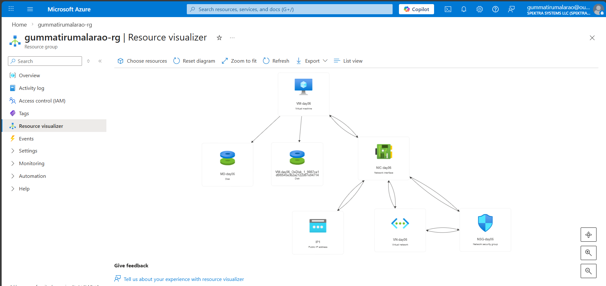

# Week1 Assignment 

## Virtual Machine Creation 

A virtual machine (VM) is a software-based emulation of a physical computer that runs an operating system and applications, completely isolated from the host machine.

### Supported Resources for Virtual machine Creation 

---

- Virtual Network (10.0.0.0/16)
   - Subnets
      - subnet1   (default              (10.0.0.0/24 -> 256 IP address))
      - subnet2   (PUB-subnet-day06     (10.0.1.0/24 -> 256 IP address)) -> 1 IP address used for VM

- NSG (security group ->  NSG-day06)
  - Created at Subnet Level and NIC Level to allow RDP protocol (3389) 

- Network Interface Card(NIC)  -> NIC-day06
  - Attached to Virtual Networks and Virtual Machine for connectivity 

- Public IP (IP1 -> 4.157.53.219) static 

- Managed Data Disk (MD-day06) -> 4GB size
  - Attached to Virtual Machine 

- Created a virtual Machine by using Vnet,NSG,Public IP,NIC,Data Disk 
  - Region: East US

---

   

