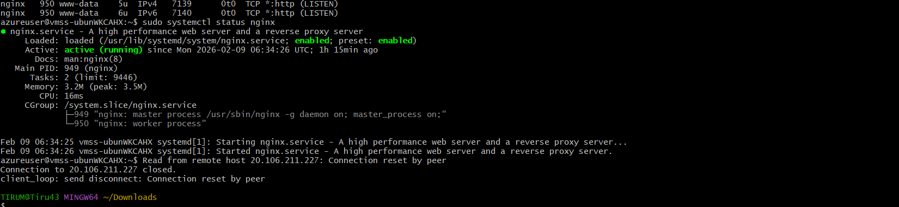

# Day06 
### 09-02-2026  

# Virtual Machine and VMSS(virtual Machine Scale sets)          TASK-1

---

- Created a Linux machine using Ubuntu-OS image
   - captured a image snapshot of Linux machine and created a image used to provision VMSS(Generalized images concept)
   - Installed the Nginx and Apache2 websers 

.png)

- Created a Windows machine using Windows-os image
   - Captured its image snapshot of Windows and created a image used to provision VMSS(Specialized images) along Auto scaling enabled a load balancer to distribute the traffic among the VMSS instances 
   - Implemented a stress load Script inside a instance which sends the traffic to instances to performace auto scaling ( which exceeds the defined threshold of CPU Utilization > 50% scale out and CPU Utilization < 20% scale in) 

### Screenshots of Implementation

.png)

.png)

---
