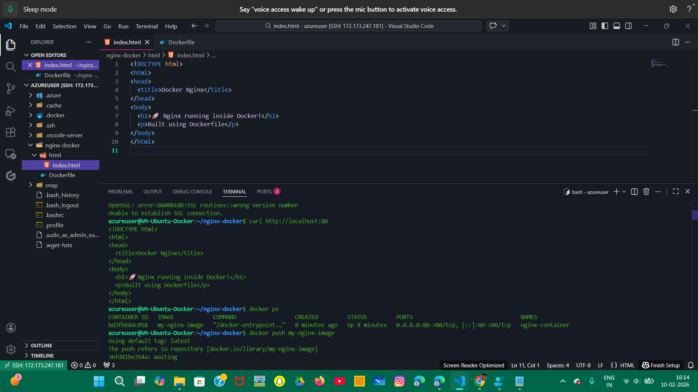
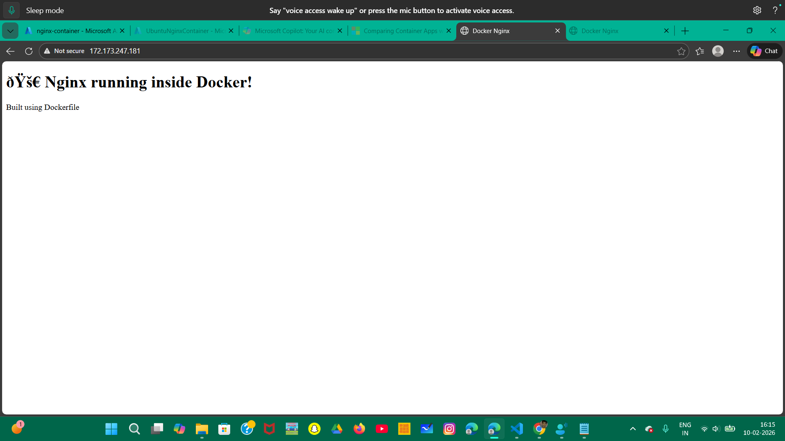
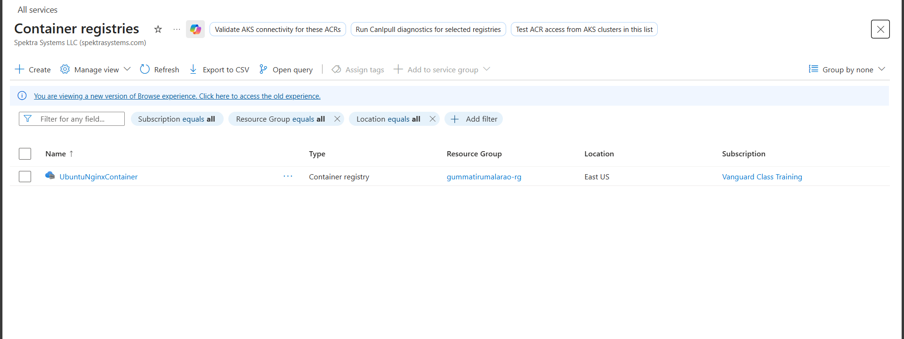
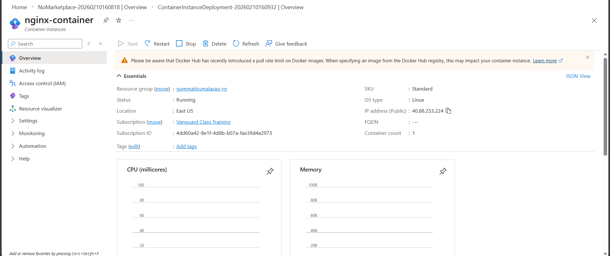
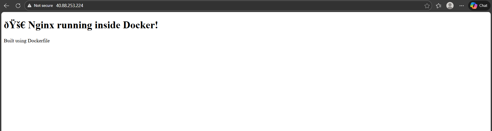

# Task-1 

## Creation of Docker and host Nginx webser in a Docker container 
- Created a Ubunut virtual Machine and Installed docker 
- Created a docker file(Dockerfile) and build to docker image(nginx-image) 
- Using the nginx-image ran a container (nginx-container) 

# Task-2 

## Volume Creation and storing the container files inside it 

- Created a volume - (nginx-volume) stored nginx-container(results) inside the volume 
- Which acts like persistant storage even after the container stops/Deleted 

# Task-3 

## Deployed the created image into the Registry 
- After creation of image push into the ACR(Azure Container Registry) by loggin into the acr registry 
- created a ACR Registry and image is pushed 

# Task-4 

## Deployed a Container Instance 

- Azure Container Instance (which is like container) -> Uses the ACR image to pull the image 
- It's able to run the Webserver -> Nginx with custom html 

