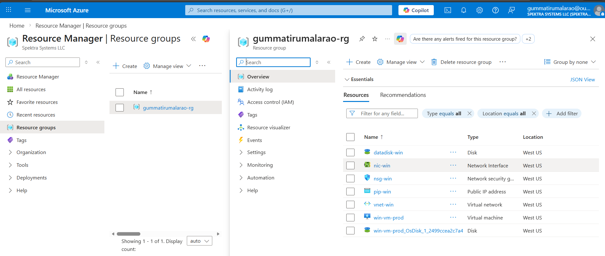
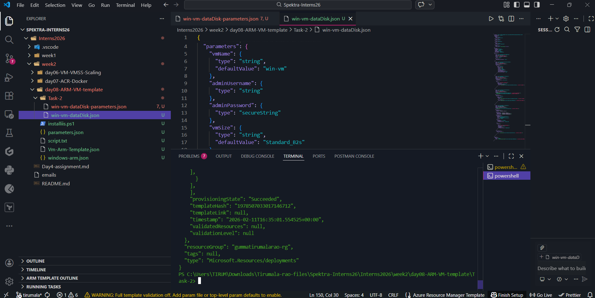
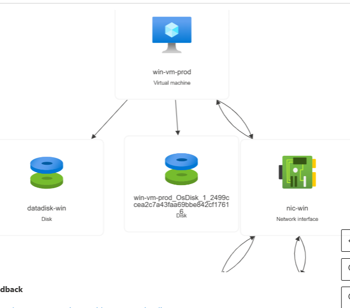
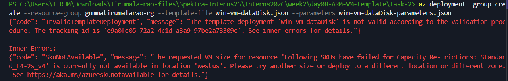

# ARM templates to Create Virtual Machines with Data Disk

- Created a Virtual machine with Windows OS in westus region 

- NSG,Public IP, NIC, Vnet, Virtual Machines

- Created two files 
  - win-vm-dataDisk.json file -> a ARM Template
  - win-vm-dataDisk-parameter -> parameters passing to win-vm-dataDisk.json 

## This shows the resources where the data Disk is attached to Virtual Machine.

#Troubleshooting 

- Selected the vmsize which is not available at selected region 
- so i tried to change the vmsize or location and correct SKU to make it work.

# Region-Specific Limitations

- Not all VM sizes available in all regions
- Capacity changes dynamically
- Must check SKUs before deployment

### During ARM deployment of a Windows VM with data disk, I encountered SKU capacity restrictions in the westus region. The template validation initially failed with SkuNotAvailable error. I diagnosed the issue using Azure CLI to list available VM sizes in that region and modified the parameter file to use a supported SKU. After correction, deployment succeeded. This helped me understand region-based capacity constraints and importance of validation before deployment.

