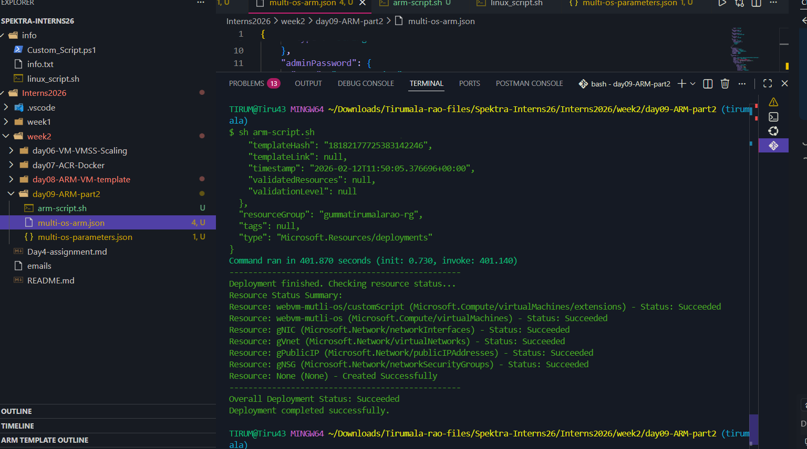
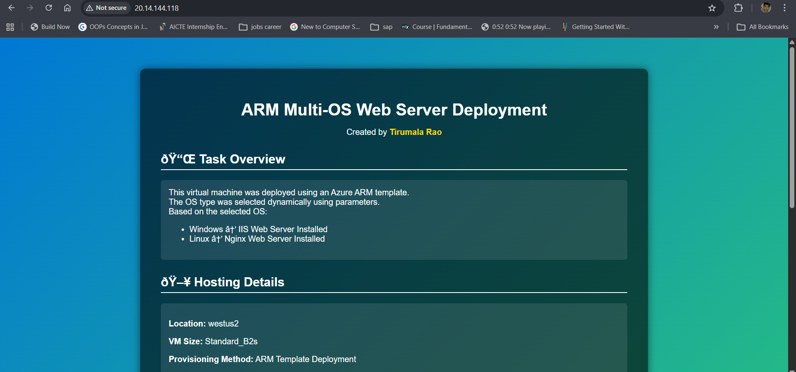

# Creation of arm templates for windows and linux to host webservers 

- Created a Azure Resource Manager template which contains the logic of azure resources which installs webservers inside the virtual machine.

- There are mainly two templates 
   - multi-os-arm.json -> Actual logic in it 
   - mulit-os-paramteres.json -> parameters values are created a separate file 

- Based on os type needs to provide to parameters and desired virtual machine is deployed throught ARM templates 

# Deployed the ARM tempaltes and its Success output 

# webpage hosted by IIS server in the windows virtual machine
