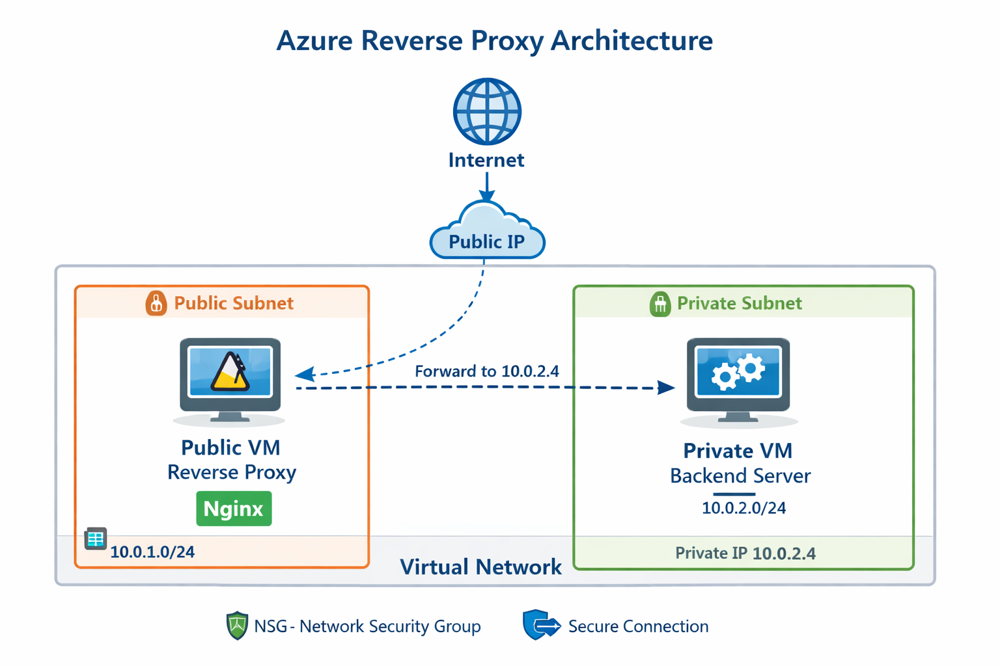
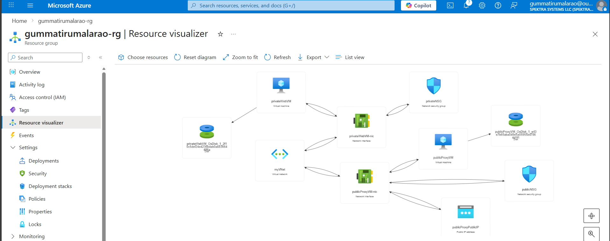
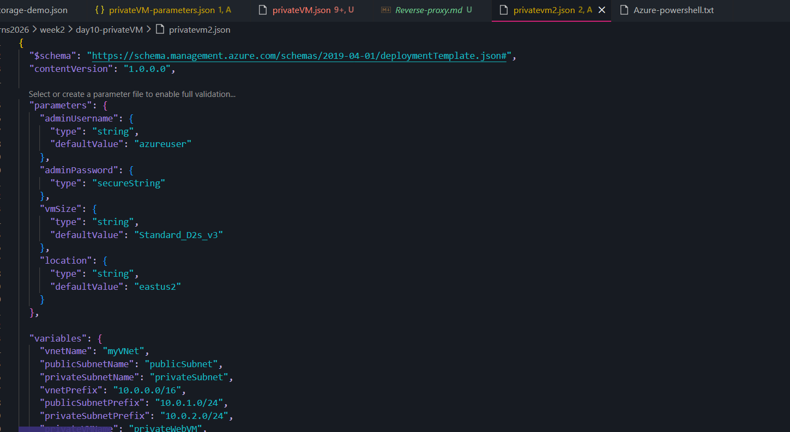
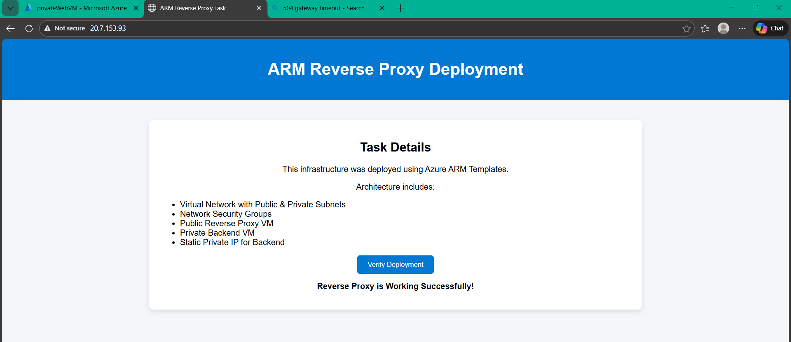

#  Azure ARM Reverse Proxy Deployment

##  Project Overview

This project demonstrates a **2-Tier Architecture** deployed using **Azure ARM Templates**, implementing a **Reverse Proxy pattern**.

The infrastructure includes:

- Virtual Network with Public & Private Subnets
- Network Security Groups (NSG)
- Public Reverse Proxy VM
- Private Backend VM
- Static Private IP Configuration
- Automated Nginx Installation using Custom Data
- Fully automated infrastructure provisioning

---

## 🏗 Architecture Diagram

Internet
↓
Public IP
↓
Public VM (Reverse Proxy - Nginx)
↓
Private VM (Backend - Nginx)




---

##  Architecture Components



### 1️ Virtual Network (VNet)
- Address Space: `10.0.0.0/16`
- Public Subnet: `10.0.1.0/24`
- Private Subnet: `10.0.2.0/24`

### 2 Network Security Groups

#### Public NSG
Allows:
- Port 80 (HTTP)
- Port 443 (HTTPS)
- Port 22 (SSH)

#### Private NSG
Allows:
- Port 80
- Only from Public Subnet (`10.0.1.0/24`)

This ensures:
- Private VM is NOT publicly accessible
- Traffic flows only through the reverse proxy

---
## ARM Templates 


##  Reverse Proxy Implementation

The Public VM is configured with Nginx to forward traffic:

```nginx
server {
    listen 80;

    location / {
        proxy_pass http://10.0.2.4;
        proxy_set_header Host $host;
        proxy_set_header X-Real-IP $remote_addr;
    }
}
```
## Accessed Webapplication using Public VM 


